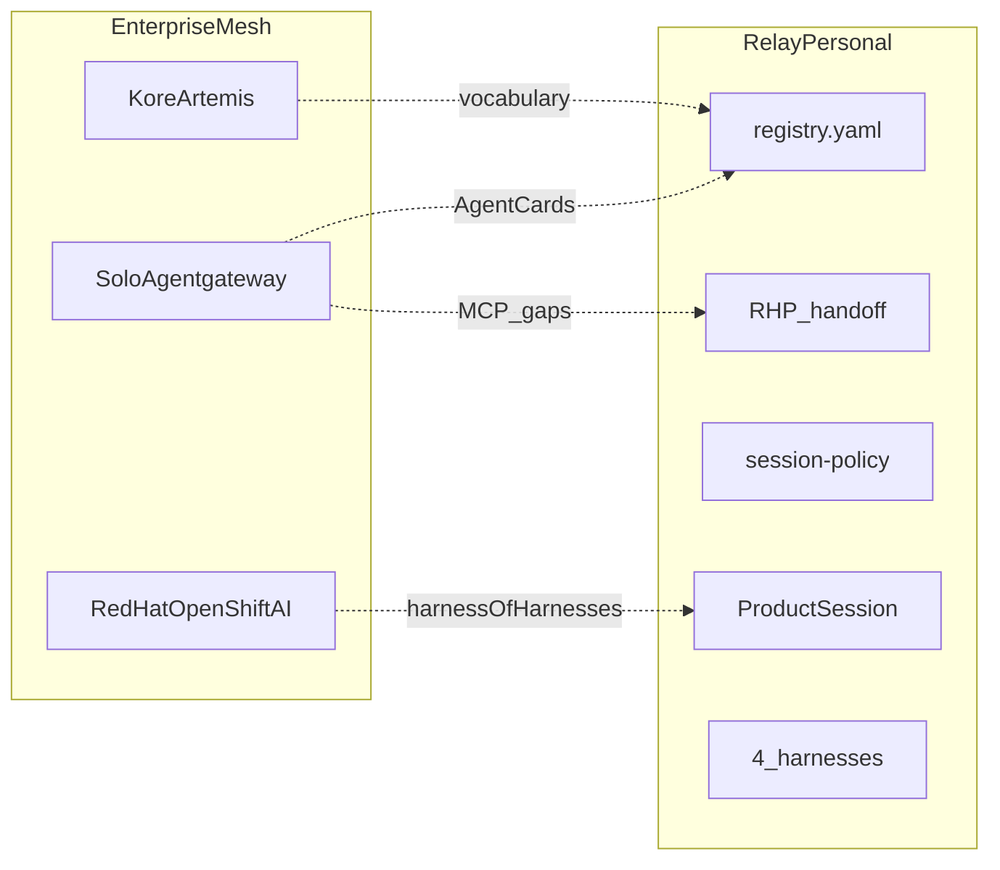

# Agent Mesh Mapping

How Relay's personal dev mesh maps to enterprise agent mesh concepts — and where we deliberately stay smaller.

## One-line framing

> Enterprise agent mesh for the terminal: configured, not coded — with every decision trail in plain files you can grep.

Relay is a **harness-of-harnesses** at laptop scale. It borrows vocabulary from Kore, Red Hat, and Solo.io without shipping their infrastructure.

---

## 5-layer mapping

| Layer | Enterprise (Kore / Red Hat / Solo) | Relay (personal, local) |
|-------|-----------------------------------|-------------------------|
| **1 — Registry** | Central agent registry, A2A Agent Cards | `relay/registry.yaml` Harness Cards |
| **2 — Communication** | mTLS fabric, A2A, MCP gateways | RHP (`handoff.json` + `HANDOFF.md`) + `relay-mcp` stdio (Dev B) |
| **3 — Governance** | Policy engine, audit, compliance | `session-policy.yaml` + `events.jsonl` |
| **4 — Orchestration** | Workflow engine, BPMN | Product Session + `relay handoff` |
| **5 — Harnesses** | Deployed agents on K8s / OpenShift | Claude, Codex, Cursor, Pi (local binaries) |

---

## Thin router (Tanner McRae / AWS pattern)

Relay adopts the **thin router** pattern: classification, not orchestration.

| Anti-pattern | Relay approach |
|--------------|----------------|
| ReACT agent loop inside Relay | ThinRouter — output is a harness name |
| LLM decides handoff steps 2–N | TypeScript pipeline: git → RHP → files → clipboard |
| Chatty multi-call orchestration | Single rule pass (OSS) or one ~3-token LLM call (Pro) |
| Relay as autonomous agent | Relay routes **to** agents; agents do the coding |

Reference: [Rethinking AI Agents: Why a Simple Router May Be All You Need](https://medium.com/towards-data-science/rethinking-ai-agents-why-a-simple-router-may-be-all-you-need)

**OSS:** `relay handoff --to auto` — regex + Harness Card strengths + failover.

**Pro (v0.2):** `relay handoff --to auto --smart` — optional single LLM classification call.

---

## What we borrow vs what we skip

### Borrow

| Concept | Source | Relay implementation |
|---------|--------|----------------------|
| Harness Cards | Solo / Google A2A | `registry.yaml` strengths/weaknesses |
| Portable context bundle | ide-bridge PCB | RHP v1 (`session.json`, `handoff.json`) |
| Inspectable governance | Red Hat | `events.jsonl`, `relay trace`, `relay doctor` |
| Failover order | harnessctl | `session-policy.yaml` failover list |
| Brownfield KPIs | Red Hat migration framework | `relay doctor --kpi` |

### Skip (deferred)

| Enterprise feature | Why skipped in MVP |
|--------------------|-------------------|
| mTLS / SPIFFE identity | Local-only; no PKI on laptop |
| HTTP agent gateway | stdio MCP only |
| K8s operator / OpenShift | No cluster assumption |
| ML routing / continuous learning | Pro tier later |
| Org-wide discovery | Single developer, single repo |

---

## Competitive position

Relay is **not** competing with Kore Artemis or Solo agentgateway at launch.

| If you need… | Use enterprise mesh | Use Relay |
|--------------|--------------------|-----------|
| Org-wide agent registry on K8s | Kore / Solo | No |
| Solo dev with 3 AI subscriptions on one repo | Overkill | **Yes** |
| Cross-vendor handoff without re-explaining | Partial (ide-bridge slice) | **Yes** |
| One `relay/` source → 4 harness formats | agent-harness slice | **Yes** (Dev B) |

---

## Post-MVP mesh roadmap

| Version | Feature | Enterprise analog |
|---------|---------|-------------------|
| v0.2 Pro | `--smart` router, OTel `--otel` | Solo observability |
| v0.2 Pro | Team session sync via git | Kore communication fabric |
| v0.3 OSS | Live mesh heartbeat | agent-peers-mcp |
| v0.3 OSS | Virtual MCP proxy | Solo virtual endpoints |
| Team tier | HTTP relay-gateway | Solo agentgateway |

---

## Further reading

- [docs/thin-router.md](./thin-router.md) — OSS routing rules and examples
- [docs/rhp-spec.md](./rhp-spec.md) — Relay Handoff Protocol v1
- [docs/security.md](./security.md) — local-only defaults and trust model
