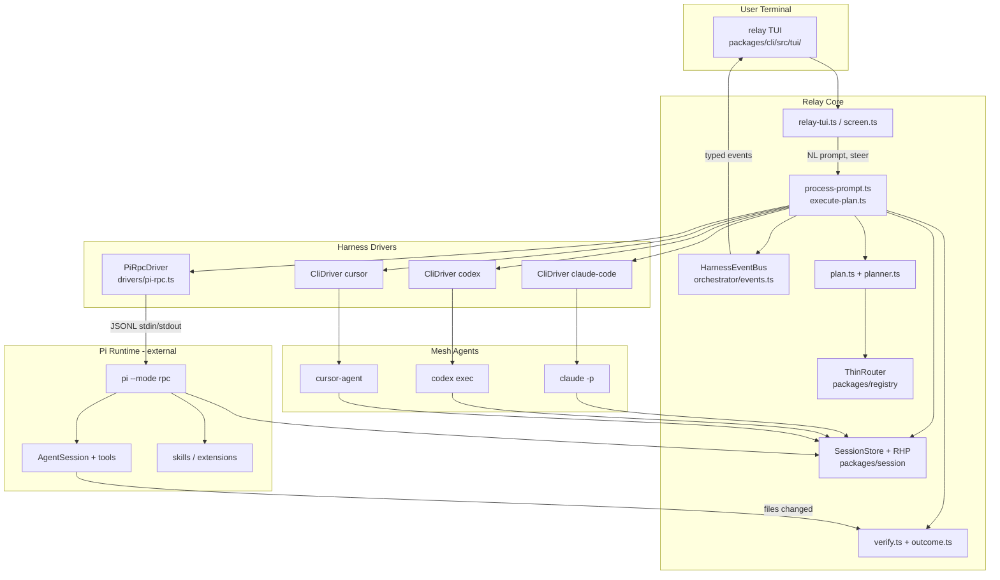
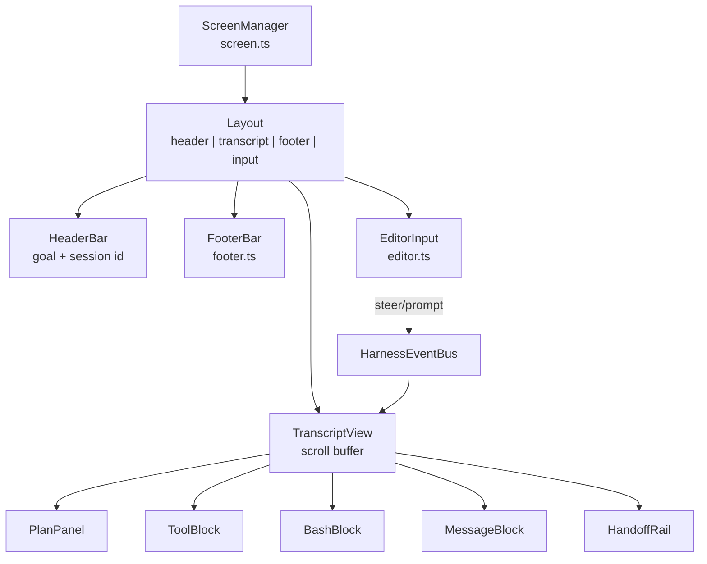

# Sprint Plan: Relay × Pi Fusion

> **Companion doc:** [pi-harness-plan.md](./pi-harness-plan.md) (5-phase technical deep-dive)  
> **Goal:** One `relay` launch → Pi-quality harness UX + Relay multi-agent mesh — fully automatic, no manual `handoff`/`next`/`done`.

---

## 1. Vision

Relay becomes the **mesh conductor** that Pi never built: one Product Session, one natural-language prompt, and automatic routing across Claude Code, Codex, Cursor, and Pi — while **Pi supplies the coding runtime** (tool loop, compaction, skills, extensions) for implement steps. The TUI should feel immediately familiar to Pi users — streaming transcript, collapsible tool blocks, model/context footer, steering while the agent runs — but be unmistakably **Relay-branded** with harness-colored step rails, wave/parallel plan panels, handoff hop history, and mesh status in the footer. Success means: type `"build a login page with tests"`, watch Pi execute tools live inside Relay, see Codex run only after files exist, and never leave the terminal.

---

## 2. Current State Audit

| Area | Status | Relay location | Gap |
|------|--------|----------------|-----|
| **Mesh brain (RHP, registry, policy)** | ✅ Done | `packages/schema`, `packages/registry`, `packages/session` | — |
| **Harness adapters + build** | ✅ Done | `packages/adapters`, `relay/` scaffold | — |
| **ThinRouter + failover** | ✅ Done | `packages/registry/src/thin-router.ts` | No LLM planner (OSS heuristic only) |
| **NL prompt → plan → execute** | 🟡 Partial | `packages/orchestrator/src/process-prompt.ts`, `plan.ts`, `execute-plan.ts` | Fixed template; no replan on failure |
| **Pi RPC driver** | 🟡 Partial | `packages/orchestrator/src/drivers/pi-rpc.ts` | No `steer`/`abort` RPC; minimal event map; no `filesTouched` |
| **CLI harness drivers** | 🟡 Partial | `packages/orchestrator/src/drivers/cli-driver.ts`, `auto-run.ts` | Exit-code success; no structured events |
| **Verification gates** | 🟡 Partial | `packages/orchestrator/src/verify.ts`, `outcome.ts` | Git diff only; no `pnpm test` gate |
| **Post-run session update** | 🟡 Partial | `packages/orchestrator/src/post-run.ts` | No transcript import from Pi session |
| **Structured harness result** | ❌ Missing | (planned) `packages/schema/src/harness-result.ts` | Can't replan or show rich summary |
| **Event pipeline orchestrator → TUI** | ❌ Missing | — | Lines are ad-hoc strings via `onLine` |
| **Pi-like TUI** | 🟡 Partial | `packages/cli/src/tui/relay-tui.ts` | Readline + line logs; no screen buffer, no tool blocks |
| **Transcript classifier** | 🟡 Partial | `packages/cli/src/tui/transcript.ts` | Regex on strings; not typed events |
| **Footer bar** | 🟡 Partial | `packages/cli/src/tui/footer.ts` | No tokens/context %; no git branch |
| **Steering while running** | ❌ Missing | `relay-tui.ts` L240–244 | Blocks input with "Still working…" |
| **Dash vs chat UX** | ❌ Diverged | `run-dash.ts` vs `relay-tui.ts` | Two REPLs, different affordances |
| **Skills runtime** | ❌ Missing | `relay/skills/` transpiled only | Not loaded into Pi RPC session |
| **relay-mcp in Pi loop** | ❌ Missing | `packages/mcp/` | Not auto-wired to Pi RPC env |
| **E2E fusion test** | ❌ Missing | `fixtures/minimal-relay/` | No prompt → files → test green path |

**Legend:** ✅ Done · 🟡 Partial · ❌ Missing

---

## 3. Pi Capabilities Inventory → Relay Modules

| Pi capability | Pi source | Relay target module | Inherit strategy |
|---------------|-----------|---------------------|------------------|
| **Tool loop** (read/edit/write/bash/grep/find/ls) | `pi-agent-core` + `packages/coding-agent/src/core/tools/` | `drivers/pi-rpc.ts` (delegate) | **Wrap** — spawn `pi --mode rpc`; never reimplement tools |
| **LLM streaming** | `pi-ai` | Pi RPC events → Relay event bus | **Wrap** |
| **AgentSession** (mode-agnostic core) | `packages/coding-agent/src/core/agent-session.ts` | `packages/orchestrator/src/drivers/pi-rpc.ts` | **Wrap** via RPC; optional SDK embed in Sprint 7+ |
| **RPC protocol** | `packages/coding-agent/src/modes/rpc/rpc-types.ts`, `rpc-mode.ts` | `packages/orchestrator/src/drivers/pi-rpc.ts`, `drivers/jsonl.ts` | **Wrap** — extend client for steer/abort/get_state |
| **SDK embed** | `packages/coding-agent/src/core/sdk.ts` | Future: `packages/orchestrator/src/drivers/pi-sdk.ts` | **Defer** — RPC first; SDK if latency matters |
| **Interactive TUI shell** | `packages/coding-agent/src/modes/interactive/interactive-mode.ts` | `packages/cli/src/tui/screen.ts` (new) | **Adapt** — use `@earendil-works/pi-tui` primitives, Relay layout |
| **Tool execution UI** | `modes/interactive/components/tool-execution.ts`, `bash-execution.ts` | `packages/cli/src/tui/components/tool-block.ts` (new) | **Port patterns** from pi-tui components |
| **Assistant/user messages** | `components/assistant-message.ts`, `user-message.ts` | `packages/cli/src/tui/components/message.ts` (new) | **Port** styling; Relay prefix colors |
| **Footer** (model, tokens, context %) | `components/footer.ts`, `core/footer-data-provider.ts` | Extend `packages/cli/src/tui/footer.ts` | **Extend** — add mesh fields (harness, step, wave) |
| **Editor** (@file, !cmd, multiline) | `components/custom-editor.ts` | `packages/cli/src/tui/editor.ts` (new) | **Port** subset; mesh slash cmds in `input.ts` |
| **Steering / follow-up queue** | RPC: `steer`, `follow_up`, `set_steering_mode` | `packages/orchestrator/src/steer-queue.ts` (new) + TUI input | **Wrap** RPC commands |
| **Compaction + auto-retry** | `core/compaction/`, RPC `compact`, `set_auto_retry` | Pi RPC session (default on) | **Inherit** — no Relay reimplementation |
| **Tree sessions / fork** | `core/session-manager.ts`, RPC `fork`, `get_tree` | Optional: map to RHP `events.jsonl` | **Defer v1** — RHP handoff sufficient |
| **Skills** | `core/skills.ts`, `core/resource-loader.ts` | `packages/orchestrator/src/skills-bridge.ts` (new) | **Bridge** `relay/skills/*.md` → Pi `--skill` or env |
| **Extensions** | `core/extensions/` | `relay/extensions/` (new, Sprint 7) | **Mirror** Pi package install pattern |
| **Slash commands** | `core/slash-commands.ts` | Merge with `packages/cli/src/tui/input.ts` | **Unify** mesh cmds + Pi cmds |
| **Themes** | `modes/interactive/theme/` | `packages/cli/src/tui/theme/relay-dark.json` (new) | **Fork theme JSON** — Relay palette |
| **MCP** | `pi-mcp-adapter` (extension) | `packages/mcp/` → Pi RPC env | **Wire** `relay mcp install` into Pi spawn env |
| **Sub-agents** | `examples/extensions/subagent/` | `packages/orchestrator/src/sub-harness.ts` (new) | **Relay-native** — spawn child harness per subtask |
| **Print / JSON modes** | `modes/print-mode.ts` | `relay run --json` (existing low-level) | **Keep** for CI; not primary UX |
| **Verification via tools** | Tool output in loop | `packages/orchestrator/src/verify.ts` | **Compose** git diff + optional test command |

---

## 4. Architecture Target



**Data flow for one implement step:**

1. User types goal → `processPrompt` → `buildRunPlan` → `executePlan`
2. Step N selects `PiRpcDriver` → spawns `pi --mode rpc --approve`
3. Pi events stream → `HarnessEventBus` → TUI renders tool blocks
4. `agent_settled` → `verifyWriteOutcome` → `recordStepOutcome` → `buildProject` → next wave

---

## 5. Sprint Breakdown (8 × 1 week)

### Sprint 1 — Pi RPC Production Driver

**Goal:** Pi RPC is the reliable implement driver; structured results flow through the orchestrator.

| Task | Files |
|------|-------|
| Define `HarnessResult` schema | `packages/schema/src/harness-result.ts`, export from `index.ts` |
| Extend `HarnessRunResult` to use schema | `packages/orchestrator/src/drivers/types.ts` |
| Complete Pi RPC client: `abort`, `get_state`, richer events | `packages/orchestrator/src/drivers/pi-rpc.ts` |
| Map Pi events → typed `HarnessEvent` | `packages/orchestrator/src/events.ts` (new) |
| Populate `filesTouched` from git diff post-run | `packages/orchestrator/src/post-run.ts`, `outcome.ts` |
| Pi RPC driver unit tests (mock stdout JSONL) | `packages/orchestrator/src/drivers/pi-rpc.test.ts` (new) |
| Default Pi for implement steps in policy | `relay/session-policy.yaml`, `packages/orchestrator/src/plan.ts` |

**Exit criteria:**
```bash
cd fixtures/minimal-relay && relay
# you › add a README section about testing
# → Pi RPC runs, tool ▶/✓ events appear, files changed, HarnessResult persisted in run state
pnpm test --filter @relay/orchestrator  # pi-rpc tests green
```

**Dependencies:** Pi CLI installed (`pi --version`).

---

### Sprint 2 — Event Pipeline + Verification Hardening

**Goal:** Orchestrator emits typed events; verification blocks bad step transitions.

| Task | Files |
|------|-------|
| `HarnessEvent` union type + emitter | `packages/orchestrator/src/events.ts` |
| Refactor `execute-plan.ts` to emit events (not only strings) | `execute-plan.ts`, `process-prompt.ts` |
| Add `onEvent` alongside `onLine` in `ProcessPromptOptions` | `process-prompt.ts` |
| Test/lint verification gate (configurable) | `packages/orchestrator/src/verify.ts`, `session-policy.ts` |
| Block test wave if implement produced 0 files (already partial — harden) | `execute-plan.ts` |
| Replan stub: mark step failed → offer retry with failover harness | `packages/orchestrator/src/replan.ts` (new) |
| Event → string adapter for backward compat | `packages/cli/src/tui/transcript.ts` |

**Exit criteria:**
```bash
relay
# you › build login form
# → events include step_start, tool_start, tool_end, step_done
# → test step skipped if no files (with clear ⊘ message)
pnpm test --filter @relay/orchestrator
```

**Dependencies:** Sprint 1.

---

### Sprint 3 — TUI Shell (Pi-like Layout)

**Goal:** Full-screen TUI shell with fixed header, scrollable transcript, pinned footer + input.

| Task | Files |
|------|-------|
| Add `@earendil-works/pi-tui` dependency | `packages/cli/package.json` |
| Screen manager (alt-screen, resize) | `packages/cli/src/tui/screen.ts` (new) |
| Layout: header / transcript / footer / input | `packages/cli/src/tui/layout.ts` (new) |
| Migrate `relay-tui.ts` to screen-based loop | `packages/cli/src/tui/relay-tui.ts` |
| Relay theme (dark) forked from Pi | `packages/cli/src/tui/theme/relay-dark.json` (new) |
| Footer: tokens, context %, git branch | `packages/cli/src/tui/footer.ts` |
| Wire `onEvent` from orchestrator to screen | `relay-tui.ts` |

**Exit criteria:**
```bash
relay
# → alt-screen TUI, footer shows harness · model · step · cwd
# → transcript scrolls; input pinned at bottom
# → Ctrl+C once shows status hint (Pi-like)
pnpm test --filter @relay/cli  # footer + layout tests
```

**Dependencies:** Sprint 2.

---

### Sprint 4 — Transcript Components (Tool Blocks + Messages)

**Goal:** Live tool execution looks like Pi — collapsible blocks, bash output, diffs.

| Task | Files |
|------|-------|
| `ToolBlockComponent` (expand/collapse, Ctrl+O) | `packages/cli/src/tui/components/tool-block.ts` (new) |
| `BashBlockComponent` | `packages/cli/src/tui/components/bash-block.ts` (new) |
| `MessageComponent` (assistant/user) | `packages/cli/src/tui/components/message.ts` (new) |
| `PlanPanelComponent` (wave + step list) | `packages/cli/src/tui/components/plan-panel.ts` (new) |
| Event router: HarnessEvent → component | `packages/cli/src/tui/transcript-view.ts` (new) |
| Port tool name / status icons from Pi patterns | reference: `/tmp/pi-explore/.../tool-execution.ts` |

**Exit criteria:**
```bash
relay
# you › create src/utils/format.ts with capitalize helper
# → see collapsible tool blocks with read/write/bash
# → Ctrl+O toggles expansion
# → plan panel shows step 1/N with harness color
```

**Dependencies:** Sprint 3.

---

### Sprint 5 — Steering, Editor, Cancel

**Goal:** User can steer mid-run; input supports Pi editor affordances.

| Task | Files |
|------|-------|
| Steering queue in orchestrator | `packages/orchestrator/src/steer-queue.ts` (new) |
| Wire `steer` RPC while Pi step running | `drivers/pi-rpc.ts` |
| Non-blocking input during `busy` | `relay-tui.ts` |
| Multiline editor (@file refs, !cmd) | `packages/cli/src/tui/editor.ts` (new) |
| RPC `abort` on double Ctrl+C | `pi-rpc.ts`, `relay-tui.ts` |
| Slash commands: `/steer`, `/status`, `/agents` | `input.ts` |

**Exit criteria:**
```bash
relay
# you › refactor auth module
# (while running) you › also add logout button
# → steer queued, Pi receives follow-up
# → double Ctrl+C cancels with clean teardown
```

**Dependencies:** Sprint 4.

---

### Sprint 6 — Multi-Agent Mesh Loop

**Goal:** One prompt runs full mesh automatically; replan + failover on failure.

| Task | Files |
|------|-------|
| Formalize `HarnessDriver` interface: `cancel()`, `streamEvents()` | `drivers/types.ts` |
| Claude RPC/`-p` structured driver | `drivers/claude.ts` (new) |
| Codex driver improvements | `drivers/codex.ts` (new) or extend `cli-driver.ts` |
| Cursor driver | `drivers/cursor.ts` (new) |
| Driver factory + tests | `drivers/factory.ts` |
| Replan on failure (retry → failover harness) | `replan.ts`, `execute-plan.ts` |
| Parallel wave UX in plan panel | `components/plan-panel.ts` |
| Optional LLM planner hook (Pro stub) | `packages/orchestrator/src/planner.ts` (new) |
| Goal analysis improvements | `goal-analysis.ts`, `plan.ts` |

**Exit criteria:**
```bash
relay
# you › build portfolio site with auth and tests
# → Plan: Pi (implement) → Codex (test) — runs automatically
# → if Pi fails, failover to claude-code once
# → parallel frontend+backend wave shows both agents
```

**Dependencies:** Sprint 5.

---

### Sprint 7 — Skills, Extensions, relay-mcp Bridge

**Goal:** `relay/skills/` and `relay-mcp` execute inside Pi sessions.

| Task | Files |
|------|-------|
| Skills loader: `relay/skills/*.md` → Pi session | `packages/orchestrator/src/skills-bridge.ts` (new) |
| Wire `relay build` output into Pi cwd context | `packages/adapters`, `execute-plan.ts` |
| Auto-install relay-mcp in Pi RPC env | `packages/cli/src/commands/mcp.ts`, `pi-rpc.ts` spawn env |
| `relay/agents/*.md` as slash sub-harnesses | `packages/orchestrator/src/sub-harness.ts` (new) |
| Extension install stub (`relay install`) | `packages/cli/src/commands/install.ts` (new) |
| Document fusion skill authoring | `docs/skills-bridge.md` (new) |

**Exit criteria:**
```bash
relay build --all
relay
# you › /skill:review src/auth.ts
# → skill loaded, Pi executes with skill context
relay mcp list  # shows tools available in Pi session
```

**Dependencies:** Sprint 6.

---

### Sprint 8 — Unify UX, E2E, Production Hardening

**Goal:** Single chat UX; dash deprecated; full fusion E2E green.

| Task | Files |
|------|-------|
| Merge dash panels into chat (plan + handoff hops) | `run-dash.ts` → deprecate; absorb into `relay-tui.ts` |
| `maxHandoffTokens` enforcement | `packages/session/src/handoff-builder.ts` |
| OTel event hooks (Pro stub) | `packages/cli/src/commands/trace.ts` |
| E2E fixture test: NL → files → verify | `fixtures/minimal-relay/e2e/fusion.test.ts` (new) |
| Mock harness drivers for CI | `packages/orchestrator/src/drivers/mock.ts` (new) |
| Update README + quickstart | `README.md`, `docs/quickstart.md` |
| Container/sandbox docs | `docs/sandbox.md` (new) |

**Exit criteria:**
```bash
pnpm test  # all packages green including e2e
relay
# you › add user login page with tests
# → complete flow, no manual handoff/next/done
relay dash  # prints deprecation notice → use relay
```

**Dependencies:** Sprint 7.

---

## 6. Sprint 1 Detail (Start Immediately)

**Week theme:** Make Pi RPC the trustworthy implement engine.

### Day 1 — Schema + protocol read

| Hour | Task | Output |
|------|------|--------|
| AM | Read Pi RPC types | Notes in PR description |
| AM | Create `HarnessResult` + `HarnessEvent` types | `packages/schema/src/harness-result.ts` |
| PM | Extend driver types | `drivers/types.ts` updated |
| PM | Unit tests for schema validation | `harness-result.test.ts` |

**Files to read:**
- `/tmp/pi-explore/packages/coding-agent/src/modes/rpc/rpc-types.ts`
- `packages/orchestrator/src/drivers/pi-rpc.ts` (current)
- `packages/orchestrator/src/drivers/jsonl.ts`

### Day 2 — Pi RPC client hardening

| Task | File |
|------|------|
| Implement `sendAbort()`, `sendSteer()` (stub used Sprint 5) | `pi-rpc.ts` |
| Handle all event types in `formatPiEvent` → `HarnessEvent` | `pi-rpc.ts`, `events.ts` |
| Fix premature exit on `agent_settled` vs error | `pi-rpc.ts` |
| Capture `filesTouched` via git diff after settle | `pi-rpc.ts`, `post-run.ts` |

### Day 3 — Tests + factory

| Task | File |
|------|------|
| JSONL mock tests for happy path + error path | `pi-rpc.test.ts` |
| Test: tool events emitted in order | `pi-rpc.test.ts` |
| Test: cancel via signal kills child | `pi-rpc.test.ts` |
| Ensure factory routes pi → PiRpcDriver | `factory.ts` (existing — add test) |

### Day 4 — Execute plan integration

| Task | File |
|------|------|
| Pass `onEvent` through execute-plan → driver | `execute-plan.ts` |
| Persist step result summary in run state | `runner-state.ts`, `types.ts` |
| Default implement steps to Pi in session policy | `relay/session-policy.yaml` |
| Manual test in `fixtures/minimal-relay` | — |

### Day 5 — Polish + docs

| Task | File |
|------|------|
| Fix any edge cases from manual testing | various |
| Add `events.ts` re-export from orchestrator index | `index.ts` |
| Update `pi-harness-plan.md` Phase 1 checklist | docs |
| Sprint 1 demo script for README | `docs/quickstart.md` |

**Sprint 1 Definition of Done:**
- [ ] `HarnessResult` schema merged
- [ ] Pi RPC driver has tests ≥80% branch coverage on jsonl parsing
- [ ] `relay` + NL prompt creates files in fixture project
- [ ] Tool start/end events visible in terminal (string form OK for Sprint 1)
- [ ] Test step blocked when implement changes 0 files
- [ ] No regression in `pnpm test`

---

## 7. TUI Spec

### Layout (ASCII wireframe)

```
┌─ Relay ────────────────────────────────────────────────────────────────┐
│ RELAY · personal dev agent mesh          goal: build login page        │
├────────────────────────────────────────────────────────────────────────┤
│ plan › Plan (2 steps, 2 waves)                                         │
│ plan ›   Wave 0: Pi (implement) — scaffold login form                  │
│ plan ›   Wave 1: Codex (test) — add unit tests                         │
├────────────────────────────────────────────────────────────────────────┤
│                                                                        │
│ you › build login page with tests                                      │
│                                                                        │
│ agent › ▶ Step 1/2: Pi running…                                        │
│ tool  › ▶ read  src/app/page.tsx                              [Ctrl+O] │
│ tool  › ✓ read  (142 lines)                                            │
│ tool  › ▶ write src/components/LoginForm.tsx                  [Ctrl+O] │
│       │  + export function LoginForm() { ...                           │
│       │  (collapsed diff preview)                                      │
│ tool  › ✓ write                                                        │
│ tool  › ▶ bash  pnpm exec tsc --noEmit                        [Ctrl+O] │
│ tool  › ✓ bash  (exit 0)                                               │
│ relay › ✓ 3 file(s) changed                                            │
│                                                                        │
│ handoff › Pi ──► session updated · handoff #3                          │
│                                                                        │
├────────────────────────────────────────────────────────────────────────┤
│ ░░░░░░░░░░░░░░░░░░░░░░░░░░░░░░░░░░░░░░░  scrollable transcript ░░░░░░░ │
├────────────────────────────────────────────────────────────────────────┤
│ relay │ harness Pi · model claude-sonnet · step 1/2 · ctx 42% · ~/app  │
├────────────────────────────────────────────────────────────────────────┤
│ you › █                                                                │
└────────────────────────────────────────────────────────────────────────┘
```

### Pi-like vs Relay-unique

| Element | Pi-like | Relay-unique |
|---------|---------|--------------|
| **Header** | Minimal, cwd-focused | "RELAY · personal dev agent mesh" + session goal |
| **Prompt prefix** | `›` on user input | `you ›` / `relay ›` dual prefix with color |
| **Tool blocks** | Collapsible, themed bg, Ctrl+O | Same interaction; **harness-colored** left border per active step |
| **Footer** | model · tokens · context % · pwd | Adds **harness · step N/M · wave · handoff #** |
| **Plan panel** | Pi has no multi-agent plan | **Wave diagram** with parallel agents (Sprint 4) |
| **Handoff rail** | N/A | Recent hops: `Claude ──► Codex` from RHP events |
| **Steering** | Queue while running | Same + **mesh commands** (`/agents`, `/handoff`) |
| **Banner** | Pi logo | **Relay cyan** wordmark, no Pi logo |
| **Theme** | Pi dark/light JSON | `relay-dark.json` — cyan/blue accent, harness palette |
| **Slash cmds** | `/compact`, `/model`, skills | Above + `status`, `agents`, `models`, `config`, `handoff` |

### Mermaid: TUI component tree



---

## 8. Risk & Decisions

### Embed Pi vs Wrap Pi vs Fork Pi

| Option | Pros | Cons | Decision |
|--------|------|------|----------|
| **Wrap Pi (RPC)** | Zero fork maintenance; Pi updates free; matches Pi CLI behavior | Subprocess overhead; requires Pi installed | ✅ **Primary path** |
| **Embed Pi SDK** | Lower latency; direct `createAgentSession()` | Heavy deps (`pi-agent-core`, `pi-ai`); OAuth/model auth duplication | 🟡 Sprint 7+ optional for Pro |
| **Fork Pi** | Full control | Maintenance nightmare; upstream drift | ❌ **Reject** |

**Decision:** **Wrap Pi via `--mode rpc`** for all implement steps. Revisit SDK embed only if subprocess latency blocks UX.

### pi-tui library vs custom ANSI

| Option | Pros | Cons | Decision |
|--------|------|------|----------|
| **`@earendil-works/pi-tui`** | Battle-tested components; Pi parity faster | External dep; API coupling | ✅ **Use for Sprint 3–4** |
| **Custom ANSI (current)** | No deps; full control | Reinvent scroll, resize, input; never catches Pi polish | ❌ Replace incrementally |
| **Ink/React** | Familiar | Wrong stack for Pi parity; heavy | ❌ Reject |

**Decision:** Add `@earendil-works/pi-tui` to `@relay/cli`; port Relay-specific components (plan panel, handoff rail) as custom pi-tui `Component`s.

### Other decisions

| Question | Decision | Rationale |
|----------|----------|-----------|
| Keep `relay dash`? | Deprecate Sprint 8 | One UX; dash logic merges into chat |
| LLM planner in OSS? | Heuristic only; Pro hook | Matches `agent-mesh-mapping.md` thin router |
| Pi session tree vs RHP? | RHP for v1 | Relay differentiator is handoff protocol |
| MCP inside loop? | relay-mcp via Pi extension env | Don't duplicate MCP server |
| Test gate default? | `pnpm test` if script exists | Opt-out in `session-policy.yaml` |

### Risks

| Risk | Impact | Mitigation |
|------|--------|------------|
| Pi RPC protocol changes | Driver breaks | Pin min Pi version in `doctor`; integration test |
| pi-tui API churn | TUI refactor | Pin version; thin adapter layer in `screen.ts` |
| Subprocess hang | Stuck relay | Timeout + RPC abort + double Ctrl+C |
| Context bloat across hops | Bad handoffs | `maxHandoffTokens` Sprint 8 |
| Two UX confusion | User churn | Deprecation notice Sprint 3; remove dash Sprint 8 |

---

## 9. Definition of Done (Entire Project)

### Harness runtime
- [ ] Pi RPC driver: prompt, steer, abort, full event stream
- [ ] Claude, Codex, Cursor drivers implement `HarnessDriver` with streaming
- [ ] Structured `HarnessResult` on every step
- [ ] Verification gates: git diff + optional test command
- [ ] Replan + failover on step failure
- [ ] Post-run: session progress, handoff build, adapter sync

### TUI
- [ ] Full-screen Pi-like layout (header, transcript, footer, input)
- [ ] Live tool/bash/message blocks with collapse
- [ ] Steering while agent runs
- [ ] Footer: harness, model, step, tokens/context %, cwd
- [ ] Plan panel with waves + parallel agents
- [ ] Handoff hop history in transcript
- [ ] Relay theme; no Pi logo
- [ ] `@file` and `!cmd` in editor
- [ ] `relay dash` deprecated

### Mesh
- [ ] One NL prompt → auto plan → auto execute all steps
- [ ] No manual `handoff` / `next` / `done` required for default flow
- [ ] Parallel implement waves (frontend + backend)
- [ ] ThinRouter + failover across 4 harnesses

### Skills & extensions
- [ ] `relay/skills/*.md` loaded into Pi sessions
- [ ] `relay-mcp` tools available in Pi RPC env
- [ ] `relay/agents/*.md` invocable as sub-harnesses

### Quality
- [ ] E2E: `fixtures/minimal-relay` NL → files → test green
- [ ] Mock drivers for CI
- [ ] `pnpm test` all green
- [ ] `relay doctor` checks Pi version + RPC health
- [ ] README + quickstart updated

### Success demo (final acceptance)
```bash
cd sample-app
relay
you › build a login page with form validation and unit tests
# → Relay plans: Pi implement → Codex test
# → Live tool blocks stream
# → Files created, tests run, all green
# → Session handoff history shows Pi → Codex hop
# → User never typed handoff, next, or done
```

---

## 10. Package Structure (Target)

```
packages/
├── schema/src/
│   ├── harness-result.ts      # NEW Sprint 1
│   └── harness-event.ts       # NEW Sprint 2
├── orchestrator/src/
│   ├── events.ts              # NEW Sprint 2
│   ├── steer-queue.ts         # NEW Sprint 5
│   ├── replan.ts              # NEW Sprint 2/6
│   ├── planner.ts             # NEW Sprint 6
│   ├── skills-bridge.ts       # NEW Sprint 7
│   ├── sub-harness.ts         # NEW Sprint 7
│   ├── drivers/
│   │   ├── pi-rpc.ts          # EXTEND Sprint 1
│   │   ├── claude.ts          # NEW Sprint 6
│   │   ├── codex.ts           # NEW Sprint 6
│   │   ├── cursor.ts          # NEW Sprint 6
│   │   ├── mock.ts            # NEW Sprint 8
│   │   └── types.ts           # EXTEND
│   ├── process-prompt.ts
│   └── execute-plan.ts
└── cli/src/tui/
    ├── relay-tui.ts           # REWRITE Sprint 3
    ├── screen.ts              # NEW Sprint 3
    ├── layout.ts              # NEW Sprint 3
    ├── editor.ts              # NEW Sprint 5
    ├── transcript-view.ts     # NEW Sprint 4
    ├── footer.ts              # EXTEND
    ├── components/            # NEW Sprint 4
    │   ├── tool-block.ts
    │   ├── bash-block.ts
    │   ├── message.ts
    │   └── plan-panel.ts
    └── theme/
        └── relay-dark.json    # NEW Sprint 3
```

---

## 11. References

| Resource | Path / URL |
|----------|------------|
| Pi harness plan (phases) | [docs/pi-harness-plan.md](./pi-harness-plan.md) |
| Agent mesh mapping | [docs/agent-mesh-mapping.md](./agent-mesh-mapping.md) |
| Thin router | [docs/thin-router.md](./thin-router.md) |
| RHP spec | [docs/rhp-spec.md](./rhp-spec.md) |
| Pi RPC types | `/tmp/pi-explore/packages/coding-agent/src/modes/rpc/rpc-types.ts` |
| Pi SDK | `/tmp/pi-explore/packages/coding-agent/src/core/sdk.ts` |
| Pi interactive mode | `/tmp/pi-explore/packages/coding-agent/src/modes/interactive/interactive-mode.ts` |
| Relay orchestrator | `packages/orchestrator/src/process-prompt.ts` |
| Relay TUI today | `packages/cli/src/tui/relay-tui.ts` |
| Pi monorepo | https://github.com/earendil-works/pi |

---

*Estimated calendar: 8 weeks (8 sprints × 1 week). Adjust Sprint 6–7 if SDK embed is prioritized over skills bridge.*
